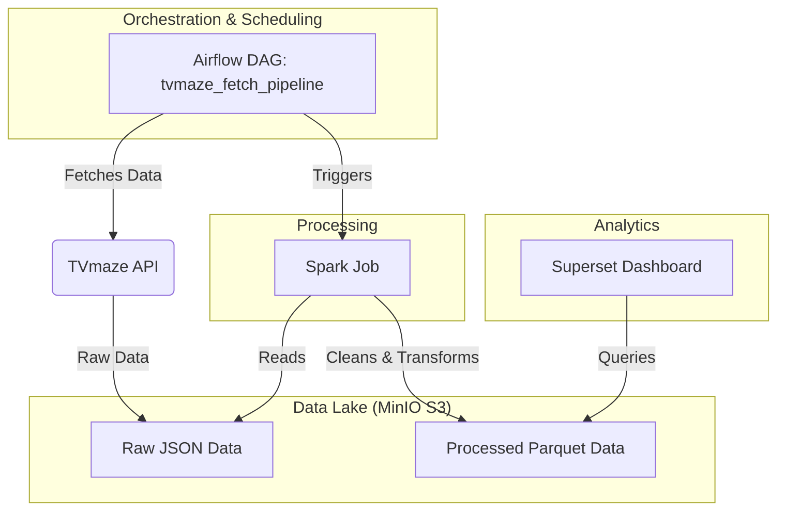

# Personal Movie Analytics Platform

This repository contains a complete, end-to-end data engineering project that builds a personal analytics platform for TV show data. The entire platform is built using modern, open-source tools and is fully containerized with Docker for easy reproducibility.

The pipeline automates the process of fetching data from a public API, processing it into a clean format, storing it in a data lake, and visualizing it in a BI tool.

---

## 🏛️ Architecture & Workflow

The project follows a modern ELT (Extract, Load, Transform) architecture. The workflow is orchestrated by Apache Airflow and is designed to be event-driven and automated.



**The workflow is as follows:**
1.  **Extraction:** An **Apache Airflow** DAG runs on a daily schedule to fetch TV show data from the public TVmaze API.
2.  **Loading (Raw Layer):** The raw, nested JSON data is loaded into a `raw` layer in our **MinIO** S3 bucket, acting as our data lake's landing zone.
3.  **Transformation:** Upon successful completion of the first DAG, a second Airflow DAG is automatically triggered. This DAG submits a **PySpark** job to our Spark cluster.
4.  **Processing:** The Spark job reads the raw JSON, cleans the data, flattens the schema, and converts it into the efficient, columnar **Parquet** format.
5.  **Loading (Processed Layer):** The clean Parquet data is written back to a `processed` layer in our MinIO data lake.
6.  **Visualization:** **Apache Superset** connects to the processed data in MinIO using DuckDB as a query engine, allowing for the creation of interactive charts and dashboards.

---

## 🛠️ Tech Stack

* **Orchestrator:** Apache Airflow
* **Data Lake / Object Storage:** MinIO (S3 Compatible)
* **Processing Engine:** Apache Spark (PySpark)
* **BI / Dashboarding:** Apache Superset
* **Query Engine for BI:** DuckDB
* **Infrastructure:** Docker & Docker Compose
* **Databases:** PostgreSQL (for Airflow & Superset metadata)

---

## 🚀 How to Run Locally

This entire platform can be run on your local machine using Docker.

**Prerequisites:**
* Docker Desktop installed and running.
* Git installed.

**Setup Instructions:**

1.  **Clone the repository:**
    ```bash
    git clone [https://github.com/your-username/your-repository-name.git](https://github.com/your-username/your-repository-name.git)
    cd your-repository-name
    ```

2.  **Start all services:**
    This single command will build the custom Airflow and Superset images and start all the containers in the background.
    ```bash
    docker-compose up -d --build
    ```
    Please allow a few minutes for all services to initialize, especially on the first run.

3.  **Access the Services:**
    Once started, you can access the different UIs in your web browser:
    * **Airflow:** `http://localhost:8080` (Login: `admin` / `admin`)
    * **MinIO Console (Data Lake):** `http://localhost:9003` (Login: `admin` / `password`)
    * **Spark Master UI:** `http://localhost:8081`
    * **Superset (BI Tool):** `http://localhost:8089` (Login: `admin` / `admin`)

4.  **Run the Pipeline:**
    * In the Airflow UI, un-pause (enable) both the `tvmaze_fetch_pipeline` and `spark_process_pipeline` DAGs.
    * Manually trigger the `tvmaze_fetch_pipeline`.
    * Once it completes, it will automatically trigger the `spark_process_pipeline`.

5.  **Visualize the Data:**
    * Follow the instructions in the project documentation to connect Superset to the data in MinIO and build your first chart.

---

## 🔮 Future Work

* Integrate **Apache Iceberg** as the table format for the data lake to enable ACID transactions and time travel.
* Implement data quality checks using **Great Expectations**.
* Add more complex transformations and feature engineering to the Spark job.
* Build a more comprehensive dashboard in Superset.
